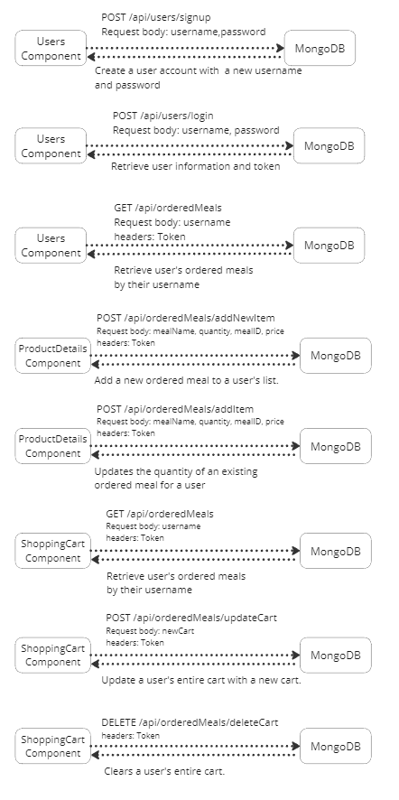

# CSIS3380 Final Project

This project entails a <b>MERN application</b> designed specifically for <b>3380 Prairie Sky Cafe</b>, where users are able to register an account and place orders. The system is also capable of keeping track of the user's shopping cart.

# Features
- Combining data from public TheMealDB API (meal name, image, mealID and Ingredients) and self-creacted API (provide meals' description and price) to render **React card components** for meal items
- **Fading-in css effect** on card rendering, **floating css effect** on card hovered, and **animation** on page links hovered
- Leverage on React state to create a **filter for user to search for desired items** based on names or prices
- **Create user account** and **login user account** functions
- Using **JWT authentication system** for authentication and authorization
- Allow user to **add items to shopping cart** with specified quantities
- Allow user to **remove items and adjust quantity of items from shopping cart**
- Use **MongoDB to record user's shopping cart items** so they can be retrieved even after the user logged out
- Use **my own API which is a backend server** to connect to and communicate with the MongoDB to do CRUD

# Tech Stack

**Frontend**: HTML, CSS, JavaScript, React.js <br>
**Backend**: Express.js, Node.js <br>
**Database**: MongoDB

# APIs

- **TheMealDB API** <br>
  https://www.themealdb.com/api.php
- **Self-creacted API in JSON format**<br>
  <i>sample item structure:</i>
  ```
  {
      "price": 5.50,
      "description": "Apam Balik - Malaysian Sweet Peanut Pancake. Indulge in the sweet and nutty flavors of Apam Balik! This popular Malaysian dessert features a crispy yet fluffy pancake made with flour, eggs, sugar, and coconut milk, filled with a delicious mixture of roasted peanuts, sugar, and butter. Satisfy your sweet tooth with every bite of this mouth-watering treat, perfect as a snack or dessert. Order now and experience the authentic taste of Malaysian cuisine with Apam Balik!"
  }
  ```
# Structure of our own API
- Our API is a server which uses **Express** to set up middleware for parsing request bodies, request routes and enabling CORS.
- This Express application also connects to the MongoDB database using Mongoose
- Our API uses two Mongoose schemas which are **userSchema** and **orderedMealsSchema**
- **orderedMealsSchema** is used to create a orderedMeals model for the meals that users can order
- **userSchema** is used to create a Users model which includes a username, hashed password and array of ordered meals associated with their account
- This API uses **JSON Web Tokens (JWTs)** for user authentication
- The following structure map is the API routes for this application:
 

# Structural Map for Components


# Getting Started

**1. Clone the repository:** 

```
git clone https://github.com/BenTsui2023/csis3380-final-project.git
```
**2. Go to the directory:**

```
cd .\csis3380-final-project\
```

**3. Install dependencies:**

```
npm i
```

**4. Ready to run:**

```
npm start
```
